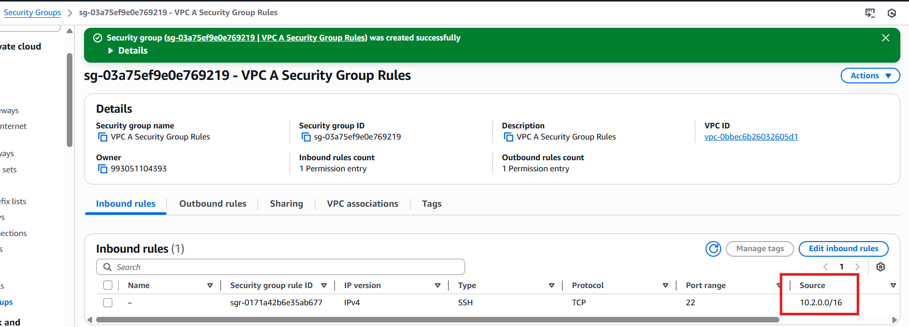

# AWS VPC Peering Setup Guide (Same Region)


This guide provides the complete, sequential steps to create two distinct VPCs with internet connectivity (public subnets) and establish a VPC Peering connection between them in the same AWS region.


**Crucial Prerequisite:** The CIDR blocks for both VPCs **must not overlap**.

## Configuration Summary

| Resource | VPC A (Requester) | VPC B (Accepter) |
| :--- | :--- | :--- |
| **VPC CIDR** | `10.1.0.0/16` | `10.2.0.0/16` |
| **Public Subnet** | `10.1.1.0/24` | `10.2.1.0/24` |
| **Private Subnet** | `10.1.2.0/24` | N/A (Optional but shown in creation) |
| **Route Table Target** | `10.2.0.0/16` -> Peering ID | `10.1.0.0/16` -> Peering ID |

---

## 🏗️ Part 1: VPC Infrastructure Build (VPC, Subnets, Internet Access)

### Step 1.1: Create VPCs

1.  **Create VPC A:**
    * **Name tag:** `VPC-A`
    * **IPv4 CIDR block:** `10.1.0.0/16`
2.  **Create VPC B:**
    * **Name tag:** `VPC-B`
    * **IPv4 CIDR block:** `10.2.0.0/16`


### Step 1.2: Create Subnets

1.  **VPC A Subnets:** (Select **VPC-A** as the VPC ID)
    * Public: Name `VPC-A-Public-Subnet`, CIDR `10.1.1.0/24`
    * Private: Name `VPC-A-Private-Subnet`, CIDR `10.1.2.0/24`
2.  **VPC B Subnets:** (Select **VPC-B** as the VPC ID)
   

    * Public: Name `VPC-B-Public-Subnet`, CIDR `10.2.1.0/24`

### Step 1.3: Create and Attach Internet Gateways (IGWs)

An IGW is required for public subnets to communicate with the internet.

1.  **VPC A IGW:**
    * Create an IGW: **Name:** `VPC-A-IGW`.
    * Select the IGW, choose **Actions** > **Attach to VPC**, and select **VPC-A**.
2.  **VPC B IGW:**
    * Create an IGW: **Name:** `VPC-B-IGW`.
    * Select the IGW, choose **Actions** > **Attach to VPC**, and select **VPC-B**.
    

    

### Step 1.4: Configure Public Subnet Routing

This configures the Route Tables (RTs) to direct internet-bound traffic (`0.0.0.0/0`) to the IGW.

1.  **VPC A Public RT:**
    * Create a custom RT: **Name:** `VPC-A-Public-RT`, **VPC:** `VPC-A`.
    * **Routes Tab:** Add route: **Destination** `0.0.0.0/0`, **Target** `VPC-A-IGW`.
    * **Subnet Associations:** Associate with `VPC-A-Public-Subnet`.
2.  **VPC B Public RT:**
    * Create a custom RT: **Name:** `VPC-B-Public-RT`, **VPC:** `VPC-B`.
    


    * **Routes Tab:** Add route: **Destination** `0.0.0.0/0`, **Target** `VPC-B-IGW`.
    

    * **Subnet Associations:** Associate with `VPC-B-Public-Subnet`.
    

    

---

## 🔗 Part 2: Establish the VPC Peering Connection

### Step 2.1: Request the Peering Connection (VPC A Side)

1.  Navigate to **VPC** > **Peering Connections** > **Create Peering Connection**.
2.  **Name:** `A-to-B-Same-Region`
3.  **VPC ID (Requester):** Select **VPC-A**.


4.  **VPC ID (Accepter):** Select **VPC-B** (Ensure *My account* and *This Region* are selected).


5.  Click **Create Peering Connection**.

> The status will be **`pending-acceptance`**.

### Step 2.2: Accept the Peering Connection (VPC B Side)

1.  In the **Peering Connections** list, select the request.
2.  Choose **Actions** > **Accept Request**..


3.  Confirm the acceptance.

> The status will transition to **`Active`**. Note the **Peering Connection ID** (`pcx-xxxxxxxx`).


---

## 🛣️ Part 3: Update Route Tables for Peering

Both VPCs must be updated to route traffic destined for the other VPC's network through the Peering Connection.

### Step 3.1: Update VPC A Route Tables

Update every Route Table in VPC A that needs to communicate with VPC B (e.g., `VPC-A-Public-RT` and the RT for the private subnet).

1.  Select the **Route Table** in VPC A.
2.  Go to the **Routes** tab, click **Edit routes**, and **Add route**:
   

    * **Destination:** **VPC B's CIDR Block** (`10.2.0.0/16`).
    * **Target:** Select **Peering Connection** and choose the `pcx-xxxxxxxx` ID.
    

3.  Click **Save changes**.

### Step 3.2: Update VPC B Route Tables

1.  Select the **Route Table** in VPC B (e.g., `VPC-B-Public-RT`).
2.  Go to the **Routes** tab, click **Edit routes**, and **Add route**:
    * **Destination:** **VPC A's CIDR Block** (`10.1.0.0/16`).
    * **Target:** Select **Peering Connection** and choose the `pcx-xxxxxxxx` ID.
3.  Click **Save changes**.

---

## 🔒 Part 4: Configure Security Groups (Final Step)

Communication will still be blocked by Security Groups (SGs) unless explicitly allowed.

1.  **VPC A Security Group Rules:**
    * **Inbound (Ingress):** Add rules allowing necessary traffic (e.g., SSH, HTTP, ICMP) with **Source** set to **VPC B's CIDR Block** (`10.2.0.0/16`).
    

2.  **VPC B Security Group Rules:**
    * **Inbound (Ingress):** Add rules allowing necessary traffic (e.g., database port) with **Source** set to **VPC A's CIDR Block** (`10.1.0.0/16`).

> **Best Practice:** When possible, reference the specific **Security Group ID** of the peer instance/resource instead of the entire CIDR block for tighter security.

---

## 🧪 Part 5: Test the Connectivity (EC2 and Ping)

To fully test the connection, launch EC2 instances in both VPCs and ensure their security groups permit communication across the peering connection.

### Step 5.1: Launch EC2 Instances

1.  **Launch Instance in VPC A (Requester):**
    * **Name:** `Test-Instance-A`
    * **VPC/Subnet:** Select `VPC-A` and `VPC-A-Public-Subnet`.
    * **Auto-assign Public IP:** **Enable** (for initial SSH access).
    * **Security Group (SG):** Allow **SSH (Port 22)** from your IP and **ICMP (All)** from `10.2.0.0/16`.

2.  **Launch Instance in VPC B (Accepter):**
    * **Name:** `Test-Instance-B`
    * **VPC/Subnet:** Select `VPC-B` and `VPC-B-Public-Subnet`.
    * **Auto-assign Public IP:** **Enable**.
    * **Security Group (SG):** Allow **SSH (Port 22)** from your IP and **ICMP (All)** from `10.1.0.0/16`.

### Step 5.2: Test Peering Communication (Ping)

1.  **Get the Private IP:** Note the **Private IP Address** of `Test-Instance-B` (e.g., `10.2.1.50`).
2.  **Connect to Instance A:** SSH into `Test-Instance-A` using its **Public IP Address**.
3.  **Perform the Test:** From the command line of `Test-Instance-A`, attempt to **ping** the **Private IP Address** of `Test-Instance-B`.

    ```bash
    ping 10.2.1.50
    ```

    * **Success:** You should see successful replies, confirming the VPC peering connection, routing, and security group rules are all configured correctly.
        ```
        64 bytes from 10.2.1.50: icmp_seq=1 ttl=62 time=0.854 ms
        ```

---

## 🗑️ Cleanup Steps (Optional)

1.  **Terminate EC2 Instances** in both VPCs.
2.  **Delete Peering Connection** (`pcx-xxxxxxxx`).
3.  **Delete Custom Routes** in both Route Tables (`VPC-A-Public-RT` and `VPC-B-Public-RT`) that reference the Peering ID.
4.  **Disassociate and Delete Internet Gateways** (`VPC-A-IGW` and `VPC-B-IGW`).
5.  **Delete Custom Route Tables** (`VPC-A-Public-RT` and `VPC-B-Public-RT`).
6.  **Delete Subnets** (Public and Private) in both VPCs.
7.  **Delete VPCs** (`VPC-A` and `VPC-B`).